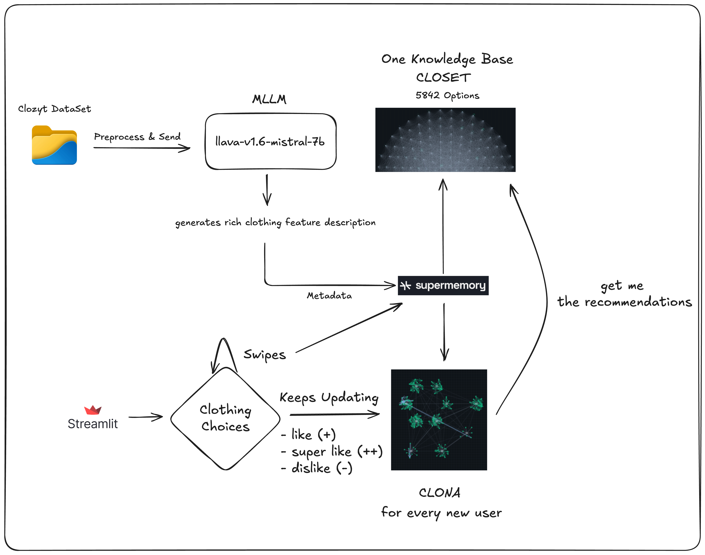

# Slapp-AI ⚡ - AI-Powered Fashion Discovery

A **Tinder-like fashion discovery app** that learns your style preferences through swiping and provides personalized clothing recommendations using AI.

## What It Does

**Imagine Tinder for Fashion** - but smarter! Users swipe through clothing items to express their preferences, and the AI learns their style to recommend products they'll actually love.

### Two-Phase Experience
- **Discovery Mode** (Swipes 1-20): Browse 6,000+ fashion items from 8+ premium brands
- **AI Mode** (Swipe 21+): Get personalized recommendations powered by SuperMemory AI
- **Real-time Learning**: Every swipe is instantly saved and analyzed

## Tech Stack

- **Frontend**: Streamlit (Python web app)
- **AI/ML**: SuperMemory API for preference learning and recommendations
- **Data**: 6,000+ products with AI-generated clothing descriptions (LLaVA Vision Model)
- **Brands**: Alo Yoga, Gymshark, NAKD, Princess Polly, Vuori, and more

## Architecture



## Project Structure

```
Slapp/
├── src/                                 # Reusable libraries/modules
│   └── supermemory/
│       ├── __init__.py
│       └── client.py                    # Shared SuperMemory client (env-driven)
├── scripts/
│   └── ingestion/
│       ├── supermemory_batch_push.py    # Bulk upload products to SuperMemory
│       ├── supermemory_push_async.py    # Async single upload example
│       ├── supermemory_helper.py        # Simple single upload example
│       └── supermemory_search.py        # Search testing helper
├── pipelines/
│   └── vision/
│       └── ViT_Img_Descriptor.py        # Vision descriptor pipeline
├── streamlit-product-display/           # Main Streamlit application
│   ├── src/
│   │   ├── app.py                       # Core app with swiping logic & UI
│   │   ├── user_memory.py               # Save preferences to SuperMemory
│   │   ├── get_user_preference.py       # Retrieve user preferences
│   │   ├── query_main_memory.py         # AI recommendation engine
│   │   ├── components/
│   │   │   └── product_card.py          # Product display components
│       └── utils/
│         └── data_loader.py           # CSV data loading utilities
│   
├── utils/
│   ├── preprocess.py                    # Unify brand-specific CSV files
│   └── download_images.py               # Download images helper
├── data/                                # Brand-specific product datasets
│   ├── alo_yoga_products.csv
│   ├── gymshark_products.csv
│   └── ...
├── archive_data/
│   └── ...
├── final_products_complete.csv          # Main product dataset (6k items)
├── requirements.txt                     # Root deps for scripts/libs
├── .gitignore
└── README.md
```

## End-to-End Flow

1) Download and preprocess images and data

- Run your image download and preprocessing utilities to build input CSVs:
  - `utils/download_images.py`
  - `utils/preprocess.py`

2) Generate clothing descriptions (Vision pipeline)

- Use the ViT descriptor to generate `clothing_features` and produce the consolidated dataset.
- Output: `final_products_complete.csv` at project root.

```
python pipelines/vision/ViT_Img_Descriptor.py
```

3) Ingest to SuperMemory (Batch)

- Ensure `.env` has your API key (see Setup below)
- Install root deps and run the batch ingestion script:

```
pip install -r requirements.txt
python scripts/ingestion/supermemory_batch_push.py
```

4) Run the Streamlit App

- Install app deps and launch:

```
streamlit run app.py
```

## Quick Setup

1. **Install dependencies**
   ```bash
   cd streamlit-product-display
   pip install -r requirements.txt
   ```

2. **Configure API key**

- Streamlit app (preferred): create `.streamlit/secrets.toml` with:

```
SUPERMEMORY_API_KEY = "your_supermemory_api_key_here"
```

- CLI/ingestion scripts: set an environment variable or use a project `.env` file at `Slapp/.env` with:

```
SUPERMEMORY_API_KEY=your_supermemory_api_key_here
```

3. **Run the app (from project app root)**
   ```bash
   cd streamlit-product-display
   streamlit run src/app.py
   ```

4. **Run ingestion scripts**

Ensure `SUPERMEMORY_API_KEY` is available in your environment (via `Slapp/.env` or shell export), then run scripts from anywhere, e.g.:

```bash
python scripts/ingestion/supermemory_batch_push.py
```

3. **Start discovering fashion**
   - Open browser to `http://localhost:8501`
   - Swipe ❤️ Like, ⭐ Super Like, or 👎 Pass on clothing items
   - Watch the AI learn your style and provide personalized recommendations

## How It Works

1. **Browse & Learn**: Users swipe through curated fashion items
2. **Preference Capture**: Each swipe is saved to SuperMemory with detailed product metadata
3. **AI Analysis**: SuperMemory analyzes collective preferences to understand user style
4. **Smart Recommendations**: AI queries the product database to find matching items
5. **Continuous Improvement**: More swipes = better recommendations

## Notes

- API keys are read from Streamlit `st.secrets`. Configure via `.streamlit/secrets.toml`. The shared client is in `src/supermemory/client.py`.
- CLI scripts under `scripts/ingestion/` locate CSVs relative to the project root, so you can run them from any directory.
- When running Streamlit, `app.py` prepends the project `src/` to `sys.path` so shared code is importable.

## Key Features

- **Session-based**: Each user gets a private style profile
- **Background AI Building**: Recommendations prepared while you browse
- **Fallback Systems**: App never breaks - switches to random products if needed
- **Rich Product Data**: AI-generated clothing descriptions enable semantic matching
